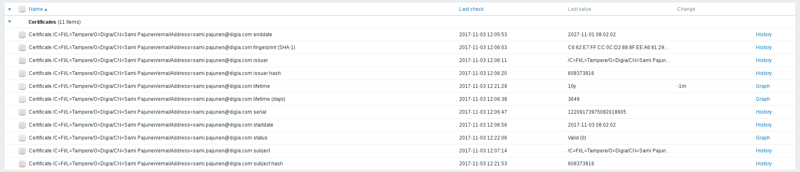

# Certificate Monitoring

Discover PEM files and monitor certificates stored within.

Discovery item scans the configured path recursively for files containing PEM
formatted certificates. Directories and files that are not readable to agent
are skipped. Make sure zabbix agent user has access to monitored files.

Monitoring script requires the following Python modules to be installed on the system (confirmed working with version in parenthesis):

* pyOpenSSL (17.3.0) URL: https://pypi.python.org/pypi/pyOpenSSL
* pem (17.1.0) URL: https://pypi.python.org/pypi/pem

## Usage

Item Syntax | Description | Units |
----------- | ----------- | ----- |
certificates.discovery[{$CERT_FILE_PATH}] | Discover certificates from path | Provides the following template variables: {#CRT_SUBJECT} {#CRT_FILE} {#CRT_INDEX} |
certificate.status[{#CRT_FILE},{#CRT_INDEX}] | Certificate status | 0 = Valid, 1 = Not yet valid, 2 = Expired |
certificate.startdate[{#CRT_FILE},{#CRT_INDEX}] | Certificate not before | ISO Date |
certificate.enddate[{#CRT_FILE},{#CRT_INDEX}] | Certificate not after | ISO Date |
certificate.lifetime[{#CRT_FILE},{#CRT_INDEX}] | Certificate lifetime until expiration (seconds) | |
certificate.lifetime_days[{#CRT_FILE},{#CRT_INDEX}] | Certificate lifetime until expiration (days) | |
certificate.serial[{#CRT_FILE},{#CRT_INDEX}] | Certificate serial | |
certificate.subject[{#CRT_FILE},{#CRT_INDEX}] | Certificate subject | |
certificate.issuer[{#CRT_FILE},{#CRT_INDEX}] | Certificate issuer | |
certificate.subject_hash[{#CRT_FILE},{#CRT_INDEX}] | Certificate subject hash | |
certificate.issuer_hash[{#CRT_FILE},{#CRT_INDEX}] | Certificate issuer hash | |
certificate.fingerprint[{#CRT_FILE},{#CRT_INDEX}] | Certificate fingerprint | SHA-1 |

## Example

