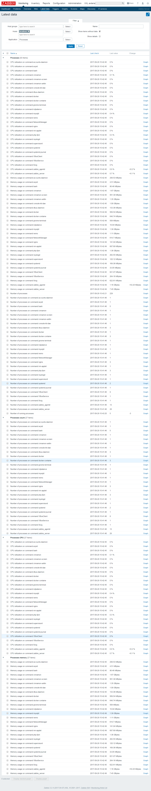

# Process Monitoring

Discover running processes in Unix/Linux/AIX environments.

Discovery uses the process name in /proc/pid/status that's truncated to 15 characters
because it's the most reliable name used by Zabbix process monitoring items (see https://www.zabbix.com/documentation/3.0/manual/appendix/items/proc_mem_num_notes)

## Usage

Item Syntax | Description | Units |
----------- | ----------- | ----- |
discover.processes | Discover all processes | Provides the following template variables: {#COMMAND} |
proc.cpu.util["{#COMMAND}"] | Process CPU utilization | % |
proc.mem["{#COMMAND}"] | Process memory usage | bytes |
proc.num["{#COMMAND}"] | Number of processes with the same command | (number) |

## Example

